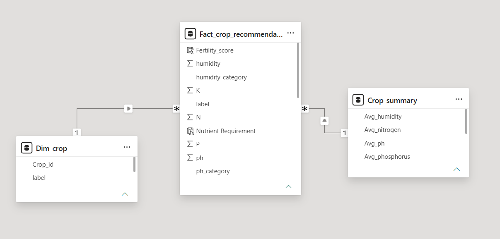
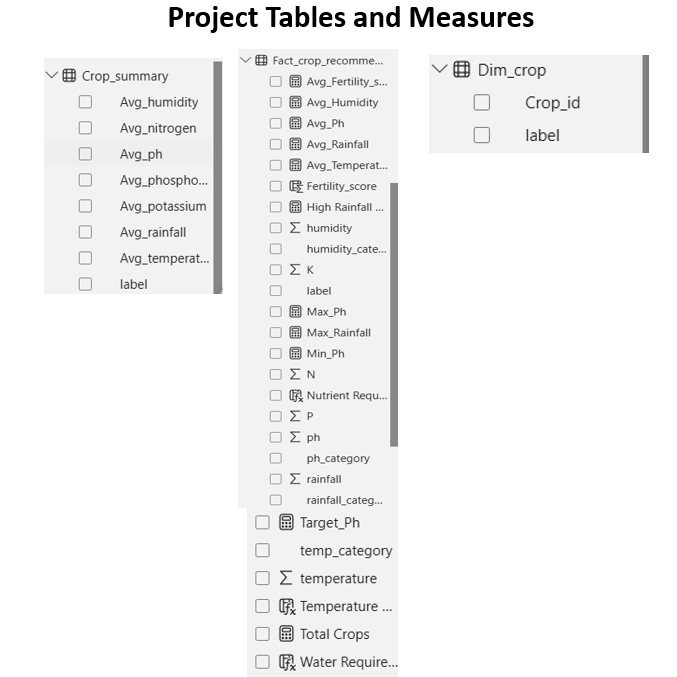
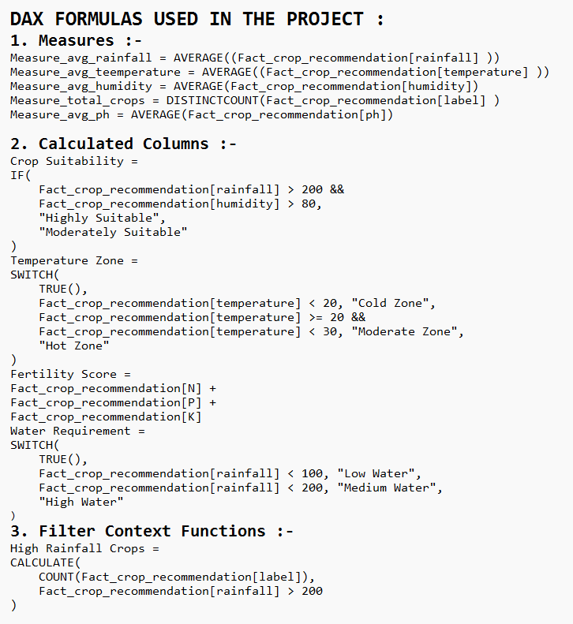
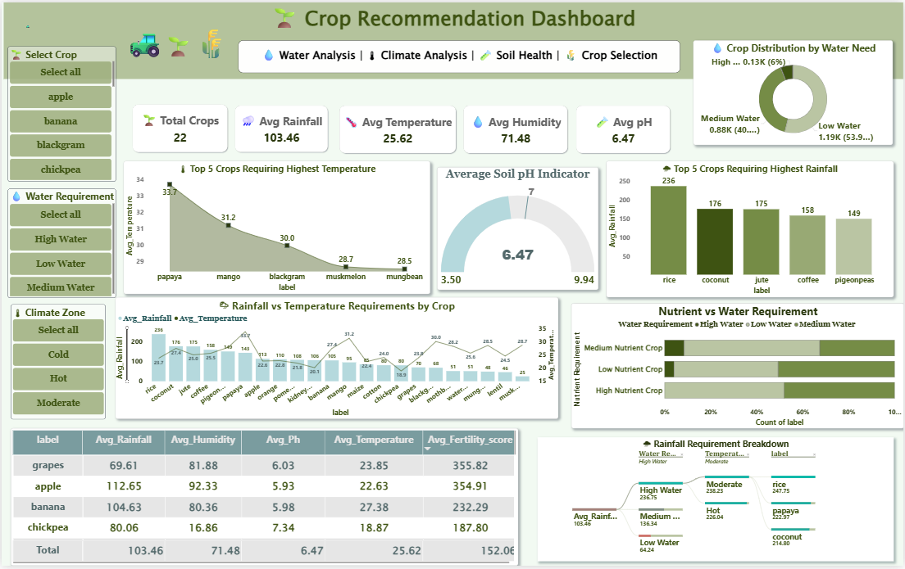

# 🌱 Crop Recommendation Analysis Dashboard | Power BI

## 📌 Project Overview

The Crop Recommendation Analysis Dashboard is an end-to-end Business Intelligence project developed using Power BI to analyze agricultural and environmental data. The project transforms raw crop recommendation data into meaningful insights through data modeling, DAX calculations, and interactive visualizations.

The dashboard helps users understand how environmental factors such as rainfall, temperature, humidity, soil nutrients, and pH levels influence crop suitability and agricultural decision-making.

This project demonstrates practical Data Analytics skills including data transformation, data modeling, DAX development, dashboard design, and business intelligence reporting.

---

## 🎯 Business Problem

Selecting suitable crops requires analyzing multiple environmental and soil-related factors. Manually evaluating these conditions can be difficult and time-consuming.

This dashboard was developed to:

* Analyze agricultural conditions efficiently.
* Monitor environmental indicators affecting crop growth.
* Identify patterns and trends across crop categories.
* Support data-driven agricultural planning.
* Provide an interactive reporting solution for crop analysis.

---

## 🛠️ Tools & Technologies

| Technology       | Purpose                        |
| ---------------- | ------------------------------ |
| Power BI Desktop | Dashboard Development          |
| Power Query      | Data Transformation & Cleaning |
| DAX              | Business Calculations          |
| Data Modeling    | Star Schema Design             |
| CSV Dataset      | Data Source                    |

---

## 📂 Dataset Information

The dataset contains agricultural and environmental parameters commonly used in crop recommendation systems.

### Key Attributes

* Nitrogen (N)
* Phosphorus (P)
* Potassium (K)
* Temperature
* Humidity
* Rainfall
* Soil pH
* Crop Label

These attributes help determine crop suitability under different environmental conditions.

---

## 🔄 Data Preparation

Data preparation was performed using Power Query to improve data quality and ensure accurate reporting.

### Activities Performed

* Data Type Validation
* Data Cleaning
* Data Standardization
* Quality Checks
* Data Transformation
* Model Optimization

---

## ⭐ Data Model (Star Schema)

### Description

A Star Schema model was implemented to create a scalable and efficient analytical structure.

The model consists of:

* A central Fact Table containing crop recommendation records.
* Supporting Dimension Tables used for categorization and filtering.

### Benefits

* Faster Report Performance
* Simplified Relationships
* Better Filter Propagation
* Improved Scalability
* Easier Maintenance

---

## 📋 Data Tables

### Description

The project contains a structured data model designed to organize agricultural information effectively.

The tables were structured to:

* Improve data organization.
* Reduce redundancy.
* Enhance model performance.
* Support analytical calculations.
* Enable efficient reporting.

This approach follows data warehousing best practices commonly used in Business Intelligence projects.

---

## 🧮 DAX Formulas

### Description

DAX (Data Analysis Expressions) was used to create dynamic calculations and analytical metrics within the dashboard.

The implementation includes:

* Aggregation Functions
* KPI Calculations
* Dynamic Filtering Logic
* Context-Aware Calculations
* Interactive Reporting Metrics

These calculations enable the dashboard to respond dynamically to user selections and provide meaningful business insights.

---

## 📊 Dashboard Overview

### Dashboard Features

The dashboard provides a comprehensive overview of crop-related environmental conditions through:

* KPI Cards
* Gauge Charts
* Matrix Reports
* Stacked Bar Charts
* Interactive Slicers
* Cross Filtering
* Comparative Analysis

### Key Areas of Analysis

* Crop Distribution
* Rainfall Analysis
* Temperature Analysis
* Humidity Analysis
* Soil pH Monitoring
* Fertility Assessment
* Water Requirement Analysis

---

## 📈 Key Insights Generated

The dashboard enables users to:

* Analyze environmental conditions affecting crop growth.
* Compare crop categories across different conditions.
* Evaluate soil health indicators.
* Monitor agricultural trends through interactive visuals.
* Understand crop suitability factors more effectively.
* Support informed agricultural decision-making.

---

## 🎛️ Interactive Features

To enhance user experience and analytical flexibility, the dashboard includes:

* Dynamic Slicers
* Cross-Visual Filtering
* Interactive KPI Tracking
* Category Segmentation
* Real-Time Metric Updates
* User-Driven Exploration

---

## 🧠 Concepts Applied

### Power BI

* Data Modeling
* Star Schema Design
* Dashboard Development
* Interactive Reporting

### DAX

* Measures
* Aggregations
* Filter Context
* Dynamic Calculations

### Data Analytics

* Data Cleaning
* Data Transformation
* Data Visualization
* Business Intelligence Reporting

---

## 🚀 Skills Demonstrated

### Technical Skills

* Power BI
* Power Query
* DAX
* Data Modeling
* Dashboard Development

### Analytical Skills

* Data Analysis
* KPI Development
* Business Intelligence
* Insight Generation
* Reporting

### Data Management

* Data Cleaning
* Data Transformation
* Data Structuring
* Data Preparation

---

## 📌 Project Outcome

Successfully transformed raw agricultural data into an interactive Power BI dashboard capable of delivering actionable insights related to crop recommendation and environmental analysis.

The project showcases practical expertise in data modeling, DAX development, dashboard creation, and business intelligence reporting while following industry-standard analytics practices.

---

## 📸 Project Screenshots

### ⭐ Star Schema Model

Shows the optimized data model used to establish relationships between fact and dimension tables.

### 📋 Data Tables

Displays the structured tables used for analysis and reporting.

### 🧮 DAX Formulas

Highlights the analytical calculations developed to support business insights and KPI reporting.

### 📊 Dashboard

Presents the final interactive dashboard used to analyze crop recommendation data and environmental conditions.

---

## 👩‍💻 Author

**Iqra Rangrej**

Aspiring Data Analyst | Power BI | SQL | Excel | Python

Passionate about transforming raw data into meaningful insights through Business Intelligence, Data Analytics, and Dashboard Development.
