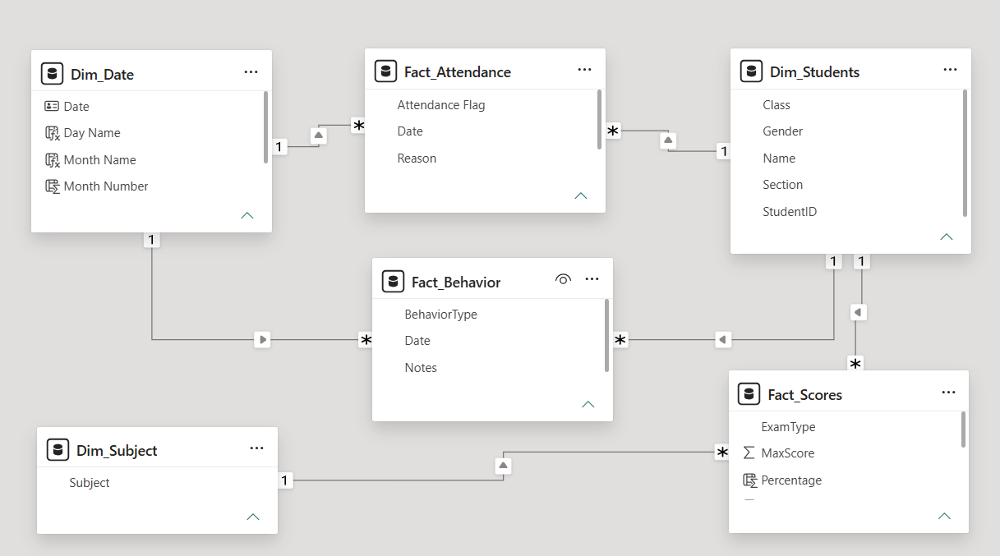
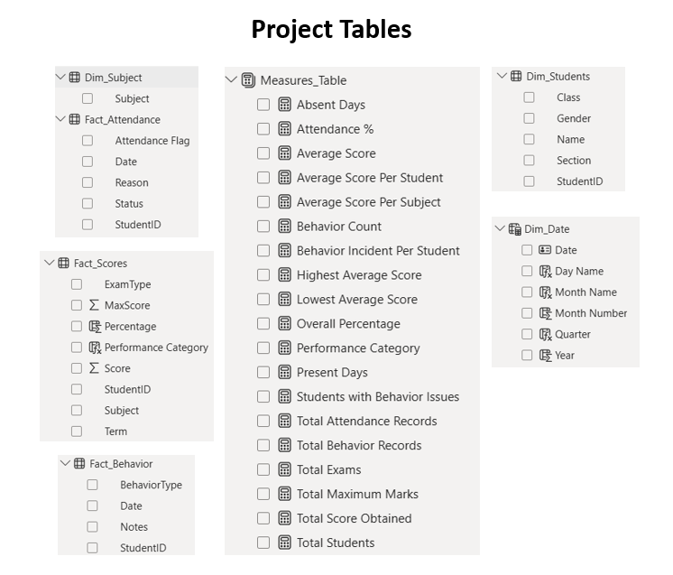
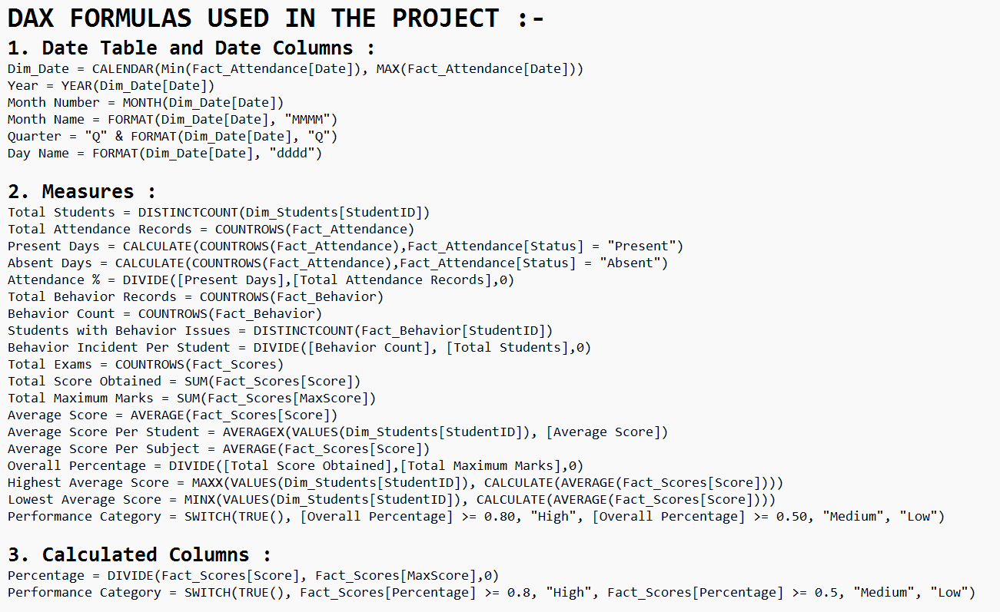
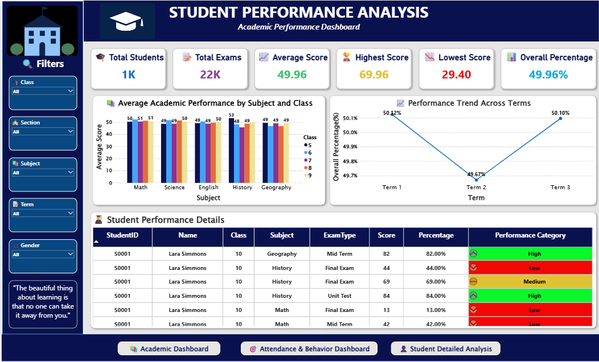
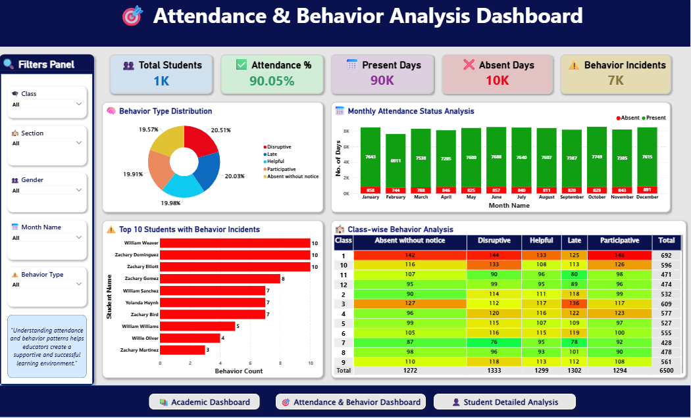
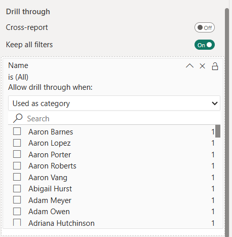
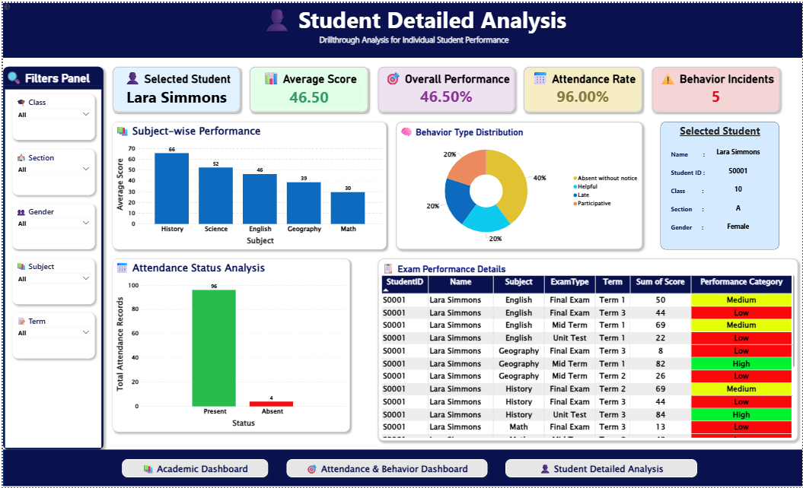

🎓 Student Performance, Attendance & Behavior Analytics Dashboard — Power BI

An end-to-end Power BI analytics solution that unifies academic performance, attendance, and behavior data for 1,000+ students into one connected reporting system.

Built on a proper Star Schema, a 25+ measure DAX layer, and three interlinked dashboards with drillthrough navigation down to the individual student — designed the way a school's data team would actually need it, not as a single flat report.

---

📌 Project Overview

Schools generate three separate streams of data — grades, attendance registers, and behavior logs — that usually live in disconnected spreadsheets.

This project integrates all three into a unified analytical model, enabling stakeholders to understand academic outcomes beyond test scores alone.

The solution answers three critical business questions:

Business Question| Dashboard
How are students performing academically, and where are the weak spots?| Academic Performance Dashboard
Are attendance or conduct issues dragging performance down, and where should we intervene first?| Attendance & Behavior Dashboard
What does the complete picture look like for one specific student, right now, in this meeting?| Student Detailed Analysis (Drillthrough)

---

🗂️ Data Model — Star Schema

The semantic model follows a clean Star Schema architecture rather than a single denormalized table.

Model Components

Dimension Tables

- Dim_Students
- Dim_Date
- Dim_Subject

Fact Tables

- Fact_Scores
- Fact_Attendance
- Fact_Behavior

Key Design Highlights

✔ Dim_Students and Dim_Date act as universal filters connected to all fact tables.

✔ Each fact table stores a single event type per row.

✔ Shared dimensions enable cross-domain analysis across scores, attendance, and behavior.

Why Star Schema?

Because all fact tables share common dimensions, filtering by:

- Class
- Student
- Term
- Date

simultaneously filters academic, attendance, and behavior data.

This enables powerful analytical questions such as:

«Do students with poor attendance also perform poorly academically?»

A flat-table model cannot answer such questions effectively.

---

🧮 DAX Layer — The Logic Behind Every Number

Every KPI in this project is powered by explicit DAX measures organized inside a dedicated Measures Table.

DAX Design Principles

📅 Dynamic Calendar

A dynamic date table is generated using:

Dim_Date =
CALENDAR(
    MIN(Fact_Attendance[Date]),
    MAX(Fact_Attendance[Date])
)

This ensures automatic expansion whenever new records are added.

---

➗ Safe Percentage Calculations

Ratios such as:

- Attendance %
- Overall Percentage

use:

DIVIDE()

to avoid divide-by-zero errors.

---

👨‍🎓 Accurate Student Averaging

Student averages are calculated using:

AVERAGEX(
    VALUES(Dim_Students[StudentID]),
    [Average Score]
)

instead of a simple AVERAGE(), preventing bias toward students with more exam records.

---

🏆 Dynamic High & Low Performer Detection

Highest and lowest performers are identified dynamically using:

- MAXX()
- MINX()
- VALUES()
- CALCULATE()

These KPIs recalculate instantly when filters change.

---

🎯 Consistent Performance Banding

Students are categorized as:

Percentage| Category
≥ 80%| High
≥ 50%| Medium
< 50%| Low

Implemented using:

SWITCH(TRUE())

both at:

- Aggregate level
- Row level

ensuring consistency throughout the report.

---

📊 Dashboard 1 — Academic Performance Analysis

Built For

👨‍🏫 Academic Heads, Principals, and Department Coordinators

Key Business Question

«Where is the academic risk, and is it tied to a subject, class, or term?»

Insights Delivered

- KPI cards provide an overall academic health snapshot.
- Subject-wise analysis highlights weak academic areas.
- Term trend analysis tracks performance changes over time.
- Conditional formatting transforms student tables into actionable intervention lists.

Typical Use Cases

- Academic review meetings
- Parent-teacher preparation
- Student intervention planning
- Cohort performance analysis

---

📊 Dashboard 2 — Attendance & Behavior Analysis

Built For

👩‍🏫 Counselors, Discipline Coordinators, and School Administrators

Key Business Question

«Is non-academic behavior creating academic risk, and where should intervention happen first?»

Insights Delivered

- Attendance trends identify seasonal absenteeism.
- Behavior distribution reveals conduct patterns.
- Top incident students become immediate counselor worklists.
- Heatmap matrix highlights classes requiring attention.

Typical Use Cases

- Weekly discipline reviews
- Attendance monitoring
- Early risk identification
- School conduct analysis

---

📊 Dashboard 3 — Student Detailed Analysis (Drillthrough)

Built For

👨‍👩‍👧 Teachers, Counselors, and Parent Meeting Discussions

Key Business Question

«What is the complete picture of one student across academics, attendance, and behavior?»

Key Features

✔ Drillthrough from Dashboard 1 and Dashboard 2

✔ Filter context preservation using:

- Keep all filters = ON
- Used as category = ON

✔ One-click access to complete student history

Insights Delivered

- Subject-wise academic performance
- Attendance status analysis
- Behavior distribution
- Individual exam records

Typical Use Cases

- Parent-teacher conferences
- Individual case reviews
- Student counseling sessions

---

🧭 Navigation Design

All dashboards share a consistent footer navigation experience built using:

- Page Navigator Buttons
- Bookmarks
- Drillthrough Navigation

This provides an application-like user experience rather than relying on default Power BI page tabs.

---

🛠️ Tech Stack

Category| Technologies
Visualization| Power BI Desktop
Data Transformation| Power Query
Data Modeling| Star Schema
Analytics| DAX
Navigation| Drillthrough, Page Navigation
Reporting| Interactive Dashboards
Formatting| Conditional Formatting

---

🚀 Why This Project Stands Out

✅ True Star Schema implementation

✅ Dynamic DAX measures with proper context handling

✅ Drillthrough with filter preservation

✅ Interactive and stakeholder-focused dashboards

✅ Business-driven visual design

✅ Cross-domain analysis across academics, attendance, and behavior

---

👩‍💻 Author

Iqra Rangrej

Skills

Power BI • Power Query • DAX • Data Modeling • Star Schema • Data Visualization • Business Intelligence
